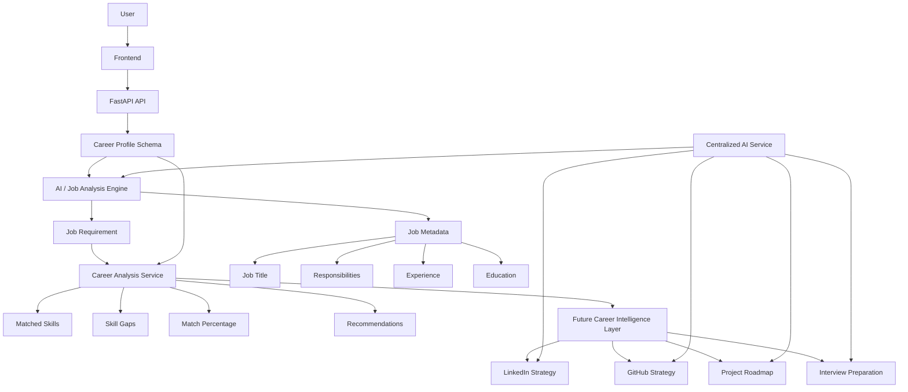

# HireCraft

## AI-Powered Career Optimization and Job Readiness Platform

HireCraft is an AI-powered career optimization platform designed to transform a target job into a structured, actionable career plan.

Instead of providing generic career advice, HireCraft analyzes a candidate's current profile against a target role or job description, identifies the skills and requirements needed for the role, evaluates the candidate's current readiness, and generates a roadmap for improving their professional presence and technical portfolio.

The long-term goal of HireCraft is to connect:

```text
Target Role / Job Description
              |
              v
       AI Analysis Engine
              |
      +-------+-------+
      |               |
      v               v
 LinkedIn Plan    GitHub Plan
      |               |
      v               v
Profile Strategy   Project Strategy
About Section     Projects to Build
Skills Positioning Repositories
Content Strategy   Technology Stack
Keywords           README Structure
Posting Ideas      Portfolio Alignment
Interview Positioning
      |               |
      +-------+-------+
              |
              v
       Career Readiness
              |
              v
     Actionable Career Plan
```

HireCraft is being developed as a modular career-intelligence platform where job requirements become structured engineering and professional-development recommendations.

---

## Table of Contents

* [Overview](#overview)
* [Problem Statement](#problem-statement)
* [Vision](#vision)
* [How HireCraft Works](#how-hirecraft-works)
* [Architecture](#architecture)
* [Current Implementation](#current-implementation)
* [Core Features](#core-features)
* [Career Analysis Engine](#career-analysis-engine)
* [Job Analysis Engine](#job-analysis-engine)
* [Skill Matching](#skill-matching)
* [Skill Gap Prioritization](#skill-gap-prioritization)
* [AI Architecture](#ai-architecture)
* [Future LinkedIn Intelligence](#future-linkedin-intelligence)
* [Future GitHub Intelligence](#future-github-intelligence)
* [Technology Stack](#technology-stack)
* [Project Structure](#project-structure)
* [Data Flow](#data-flow)
* [API Reference](#api-reference)
* [Request and Response Models](#request-and-response-models)
* [Getting Started](#getting-started)
* [Environment Configuration](#environment-configuration)
* [Running the Backend](#running-the-backend)
* [Running the Frontend](#running-the-frontend)
* [API Documentation](#api-documentation)
* [Screenshots](#screenshots)
* [Example Analysis](#example-analysis)
* [Validation and Error Handling](#validation-and-error-handling)
* [Development Roadmap](#development-roadmap)
* [Engineering Practices](#engineering-practices)
* [Security](#security)
* [Known Limitations](#known-limitations)
* [Contributing](#contributing)
* [License](#license)
* [Author](#author)

---

# Overview

Hiring is increasingly driven by alignment between a candidate's skills, projects, professional profile, and the requirements of a specific role.

However, most career tools treat these areas separately.

A candidate may know:

* The role they want
* The technologies they need to learn
* The projects they should build
* The LinkedIn profile they should improve
* The GitHub repositories they should create

But there is often no single system connecting all of these decisions.

HireCraft is designed to solve this problem.

The platform takes a target career direction and turns it into a structured analysis:

```text
Career Goal
     |
     v
Job Requirements
     |
     v
Candidate Profile
     |
     v
Gap Analysis
     |
     +----------------------+
     |                      |
     v                      v
Professional Strategy   Technical Strategy
     |                      |
     v                      v
 LinkedIn                GitHub
     |                      |
     +----------+-----------+
                |
                v
        Career Roadmap
```

---

# Problem Statement

Traditional career advice is usually generic.

Examples:

```text
Improve your resume.
Learn more technologies.
Build projects.
Improve your LinkedIn.
Practice interviews.
```

The problem is that these recommendations are not specific to the job the candidate is targeting.

For example, a candidate targeting a Python Backend Developer role may need:

```text
Python
SQL
FastAPI
PostgreSQL
REST APIs
Git
Docker
```

But simply knowing that these technologies exist does not answer:

* Which skills are already strong?
* Which skills are missing?
* Which gaps should be fixed first?
* Which projects should demonstrate those skills?
* What should the GitHub repository contain?
* How should the candidate position those skills on LinkedIn?
* Which keywords should appear in the professional profile?
* What interview areas should be prioritized?

HireCraft is designed to connect these decisions into one workflow.

---

# Vision

The long-term HireCraft architecture is:

```text
USER INPUT
    |
    +----------------------+
    |                      |
    v                      v
Job Description        Target Role
    |                      |
    +----------+-----------+
               |
               v
       AI / Analysis Engine
               |
       +-------+-------+
       |               |
       v               v
 LinkedIn Plan      GitHub Plan
       |               |
       |               |
       v               v
Profile Strategy    Projects to Build
About Section       Repositories
Skills Positioning  Technology Stack
Content Strategy    README Structure
Keywords            Portfolio Alignment
Posting Ideas       Project Roadmap
Interview Positioning
       |               |
       +-------+-------+
               |
               v
       Career Readiness
               |
               v
      Actionable Roadmap
```

This architecture allows HireCraft to evolve from a job-description analyzer into a broader career intelligence system.

---

# How HireCraft Works

The current implementation focuses on the core analysis engine.

The current pipeline is:

```text
Candidate Profile
       |
       v
Target Job Description
       |
       v
Job Analysis
       |
       +-----------------------------+
       |                             |
       v                             v
Required Skills              Job Requirements
       |                     - Job Title
       |                     - Responsibilities
       |                     - Experience
       |                     - Education
       |
       v
Career Profile Comparison
       |
       +-------------------------------+
       |               |               |
       v               v               v
Matched Skills    Skill Gaps      Match Percentage
                       |
                       v
                Gap Prioritization
                       |
                       v
                 Recommendations
```

The planned platform extends this pipeline:

```text
Analysis Result
       |
       +--------------------+
       |                    |
       v                    v
LinkedIn Strategy      GitHub Strategy
       |                    |
       v                    v
Professional Brand     Technical Portfolio
       |                    |
       +----------+---------+
                  |
                  v
          Career Roadmap
```

---

# Architecture

## High-Level Architecture



---

# Current Implementation

HireCraft currently implements the core job-alignment engine.

The repository contains:

```text
backend/
frontend/
docs/
.env.example
LICENSE
README.md
```

The backend is organized into:

```text
app/
├── ai/
├── routers/
├── schemas/
├── services/
└── main.py
```

The current AI layer contains:

```text
client.py
config.py
errors.py
models.py
provider.py
retry.py
service.py
validation.py
prompts/
```

The current analysis layer contains:

```text
routers/analysis.py

services/analysis.py
services/job_analysis.py

schemas/career.py
schemas/job.py
schemas/analysis.py
```

The frontend contains:

```text
frontend/
├── css/
├── js/
└── index.html
```

This separation keeps API routing, validation, job analysis, career comparison, AI communication, and frontend presentation independent from one another.

---

# Core Features

## 1. Career Profile Input

The current career profile accepts:

* Full name
* Current role
* Skills
* Experience
* Projects
* Education
* Target job description

The current Pydantic model validates the target job description and requires meaningful input before analysis.

---

## 2. Job Description Analysis

HireCraft analyzes the supplied job description and converts it into structured requirements.

The current engine extracts:

* Job title
* Required technical skills
* Responsibilities
* Experience level
* Education requirement

These values are represented through the `JobRequirement` schema.

---

## 3. Skill Extraction

The current engine checks a defined set of technical skills, including areas such as:

```text
Python
FastAPI
Django
Flask
Java
JavaScript
TypeScript
React
HTML
CSS
SQL
MySQL
PostgreSQL
MongoDB
Git
GitHub
Docker
AWS
Azure
REST API
Machine Learning
Deep Learning
Pandas
NumPy
Excel
Power BI
```

The extracted skills are normalized before being used for comparison.

---

## 4. Skill Normalization

HireCraft normalizes common variations so equivalent skills are not unnecessarily treated as different technologies.

Examples:

```text
postgres     -> postgresql
js           -> javascript
ts           -> typescript
rest apis    -> rest api
```

Generic `api` is removed when `rest api` is already present.

This creates a cleaner comparison between the job requirements and the candidate profile.

---

## 5. Responsibility Extraction

The job-analysis engine looks for responsibility-oriented language such as:

```text
develop
design
build
maintain
implement
test
debug
deploy
integrate
write
create
manage
optimize
```

Sentences containing these verbs can be captured as job responsibilities, subject to the current sentence-length and duplicate filters.

---

## 6. Experience Detection

The current implementation recognizes common experience descriptions such as:

```text
Fresher
Entry Level
1+ Year
2+ Years
3+ Years
```

and returns a structured experience level.

---

## 7. Education Detection

The job requirement model contains a dedicated education field so education requirements can be represented separately from skills and experience.

---

## 8. Skill Matching

The analysis service compares:

```text
Candidate Skills
        vs
Required Job Skills
```

The result contains:

```text
Matched Skills
Missing Skills
Skill Gaps
Strengths
Match Percentage
Recommendations
```

The current implementation performs normalized set intersection and difference to determine matched and missing skills.

---

## 9. Match Percentage

The current matching calculation is:

```text
Number of Matched Required Skills
---------------------------------- × 100
Total Required Skills
```

The resulting percentage is rounded to two decimal places.

This metric is intended as a skill-alignment indicator rather than a prediction of whether a company will hire the candidate.

---

## 10. Skill Gap Prioritization

Missing skills are categorized using the current priority rules.

### High Priority

```text
Python
SQL
FastAPI
PostgreSQL
```

### Medium Priority

```text
JavaScript
React
Git
Docker
```

### Low Priority

Other detected missing skills.

The system then sorts skill gaps by priority before generating recommendations.

---

## 11. Recommendations

Recommendations are generated from identified skill gaps.

Example:

```text
Learn FastAPI — High Priority
Learn PostgreSQL — High Priority
Learn Docker — Medium Priority
```

The recommendation engine uses display-name mappings so technical skills are presented in readable form.

---

# Career Analysis Engine

The core career analysis service accepts two structured objects:

```text
CareerProfile
      +
JobRequirement
      |
      v
analyze_career_profile()
      |
      v
AnalysisResult
```

The analysis service performs:

```text
1. Normalize candidate skills
2. Normalize required skills
3. Find matched skills
4. Find missing skills
5. Generate skill-gap objects
6. Assign priorities
7. Calculate match percentage
8. Determine strengths
9. Generate recommendations
10. Return structured AnalysisResult
```

This architecture keeps business logic outside the API router.

---

# Job Analysis Engine

The job analysis service converts unstructured job-description text into a structured object.

```text
Raw Job Description
        |
        v
Text Normalization
        |
        v
Skill Detection
        |
        v
Skill Normalization
        |
        v
Responsibility Detection
        |
        v
Experience Detection
        |
        v
Education Detection
        |
        v
JobRequirement
```

Current structured output:

```json
{
  "job_title": "Backend Developer",
  "required_skills": [
    "python",
    "fastapi",
    "sql",
    "postgresql"
  ],
  "responsibilities": [
    "Develop backend services",
    "Build REST APIs"
  ],
  "experience_level": "1+ year",
  "education": "Not specified"
}
```

---

# AI Architecture

HireCraft contains a centralized AI service.

The architecture is intentionally designed so that future AI modules do not call the LLM directly.

```text
                    AI Service
                       |
          +------------+------------+
          |                         |
          v                         v
      AI Client                 AI Models
          |
          v
     LLM Provider
```

The current `AIService` provides:

```text
generate()
generate_json()
```

The JSON pathway validates the model response by parsing it into a Python dictionary and raises a controlled AI error when invalid JSON is returned.

The AI service is explicitly intended to become the shared entry point for future modules including:

```text
LinkedIn
GitHub
Projects
Interview
```

This prevents duplicated LLM integration logic across the application.

---

# Future LinkedIn Intelligence

LinkedIn intelligence is part of the planned HireCraft architecture.

The future LinkedIn module will transform job requirements into professional positioning recommendations.

## Planned Input

```text
Target Role
       or
Job Description
```

## Planned Analysis

```text
Job Requirements
       |
       v
Required Skills
       |
       v
Professional Positioning
```

## Planned Output

### Profile Strategy

Recommendations for presenting the candidate according to the target role.

### About Section

Generate a role-aligned professional summary.

### Skills Positioning

Identify:

```text
Primary Skills
Secondary Skills
Supporting Skills
```

### Content Strategy

Recommend professional topics that demonstrate knowledge relevant to the target role.

### Keywords

Identify role-specific keywords that should appear naturally across the professional profile.

### Posting Ideas

Generate technical content themes related to:

```text
Projects
Technologies
Problem Solving
Learning Progress
Engineering Concepts
Industry Topics
```

### Interview Positioning

Connect the professional profile with likely interview discussion areas.

---

# Future GitHub Intelligence

GitHub intelligence is another planned HireCraft capability.

The objective is to transform a target role into a technical portfolio strategy.

```text
Target Job
    |
    v
Required Skills
    |
    v
Technical Gaps
    |
    v
Projects to Build
    |
    v
GitHub Portfolio
```

## Planned Output

### Projects to Build

Recommend projects that demonstrate missing or high-value skills.

Example:

```text
Job Requirement:
Python + FastAPI + PostgreSQL

Project Recommendation:
Production-style REST API
```

### Repository Strategy

Each recommended project can have:

```text
Repository Name
Description
Technology Stack
Architecture
Features
Folder Structure
Testing Strategy
Deployment Strategy
```

### Technology Stack

The engine can identify which technologies should be demonstrated through projects.

### README Structure

Each recommended project can include a professional documentation strategy:

```text
Project Overview
Problem Statement
Features
Architecture
Technology Stack
Setup
API Documentation
Screenshots
Testing
Deployment
Future Improvements
```

### Portfolio Alignment

Projects should not be selected randomly.

They should be connected to:

```text
Target Role
       |
       v
Job Requirements
       |
       v
Skill Gaps
       |
       v
Projects
       |
       v
GitHub Portfolio
```

### Project Roadmap

The future GitHub intelligence layer can produce a prioritized project-building sequence.

---

# Planned Career Intelligence Layer

The long-term architecture combines the analysis engine with LinkedIn and GitHub intelligence.

```text
                     Target Role
                         |
                         v
                 Job Description
                         |
                         v
                Job Analysis Engine
                         |
          +--------------+--------------+
          |                             |
          v                             v
      Job Skills                  Job Requirements
          |                             |
          +--------------+--------------+
                         |
                         v
                Career Gap Analysis
                         |
          +--------------+--------------+
          |                             |
          v                             v
   LinkedIn Strategy              GitHub Strategy
          |                             |
          v                             v
 Professional Brand             Technical Portfolio
          |                             |
          +--------------+--------------+
                         |
                         v
                Interview Positioning
                         |
                         v
                Career Roadmap
```

This architecture is the primary direction for future HireCraft development.

---

# Technology Stack

| Layer             | Technology              |
| ----------------- | ----------------------- |
| Language          | Python                  |
| Backend Framework | FastAPI                 |
| Data Validation   | Pydantic                |
| Configuration     | Pydantic Settings       |
| HTTP Client       | HTTPX                   |
| AI Integration    | Centralized LLM Service |
| Frontend          | HTML5                   |
| Styling           | CSS3                    |
| Client Logic      | JavaScript              |
| API Server        | Uvicorn                 |
| API Specification | OpenAPI / Swagger       |
| Version Control   | Git / GitHub            |

The current backend dependency set includes FastAPI, Pydantic, Pydantic Settings, HTTPX, Uvicorn, and supporting runtime packages.

---

# Project Structure

```text
HireCraft/
│
├── backend/
│   │
│   ├── app/
│   │   │
│   │   ├── ai/
│   │   │   ├── prompts/
│   │   │   ├── client.py
│   │   │   ├── config.py
│   │   │   ├── errors.py
│   │   │   ├── models.py
│   │   │   ├── provider.py
│   │   │   ├── retry.py
│   │   │   ├── service.py
│   │   │   └── validation.py
│   │   │
│   │   ├── routers/
│   │   │   └── analysis.py
│   │   │
│   │   ├── schemas/
│   │   │   ├── analysis.py
│   │   │   ├── career.py
│   │   │   └── job.py
│   │   │
│   │   ├── services/
│   │   │   ├── analysis.py
│   │   │   └── job_analysis.py
│   │   │
│   │   └── main.py
│   │
│   └── requirements.txt
│
├── frontend/
│   ├── css/
│   │   └── main.css
│   │
│   ├── js/
│   │   └── main.js
│   │
│   └── index.html
│
├── docs/
│   ├── architecture.md
│   ├── project.md
│   └── roadmap.md
│
├── .env.example
├── .gitignore
├── LICENSE
└── README.md
```

The repository currently contains the backend application, frontend, and documentation structure shown above.

---

# Data Flow

## Current End-to-End Flow

```text
Frontend Form
     |
     v
POST /api/analyze
     |
     v
CareerProfile Validation
     |
     v
AI Job Analysis
     |
     v
JobRequirement
     |
     v
Career Analysis Service
     |
     +-------------------------+
     |          |              |
     v          v              v
Matched     Skill Gaps    Match Percentage
Skills          |
                v
            Priorities
                |
                v
         Recommendations
                |
                v
          JSON Response
                |
                v
           Frontend UI
```

The API router currently sends `target_job_description` to the AI analysis service and then passes the resulting `JobRequirement` into the career-analysis service before returning the structured result.

---

# API Reference

## Base URL

```text
http://127.0.0.1:8000
```

---

## GET /

Checks that the HireCraft API is running.

### Response

```json
{
  "message": "HireCraft API is running"
}
```

---

## GET /health

Returns the application health status.

### Response

```json
{
  "status": "healthy"
}
```

The root and health endpoints are defined directly in `backend/app/main.py`.

---

## POST /api/analyze

Runs the complete current career-analysis pipeline.

### Request

```json
{
  "full_name": "Candidate Name",
  "current_role": "Python Developer",
  "skills": "Python, SQL, Git",
  "experience": "1 year",
  "projects": "Career analysis platform",
  "education": "Bachelor's Degree",
  "target_job_description": "We are looking for a backend developer with Python, FastAPI, PostgreSQL, SQL and Git experience."
}
```

### Processing

```text
Request
   |
   v
CareerProfile
   |
   v
AI Job Analysis
   |
   v
JobRequirement
   |
   v
Career Comparison
   |
   v
AnalysisResult
```

### Response

```json
{
  "status": "success",
  "message": "Career analysis completed successfully",
  "data": {
    "profile": {},
    "job_requirements": {},
    "analysis": {}
  }
}
```

The current router returns the candidate profile, structured job requirements, and final analysis under the `data` object.

---

# Request and Response Models

## CareerProfile

```text
full_name
current_role
skills
experience
projects
education
target_job_description
```

The current target job description is required and must contain at least 20 characters.

---

## JobRequirement

```text
job_title
required_skills
responsibilities
experience_level
education
```

These fields represent the structured output of the job-analysis layer.

---

## AnalysisResult

The current analysis response contains:

```text
match_percentage
matched_skills
skill_gaps
strengths
recommendations
```

---

# Getting Started

## Prerequisites

Install:

```text
Python 3.10+
Git
VS Code
```

An LLM provider configuration is required for the AI analysis pathway.

---

# Clone the Repository

```bash
git clone https://github.com/sselvaa202-cpu/HireCraft.git
cd HireCraft
```

---

# Backend Setup

Move into the backend:

```bash
cd backend
```

Create a virtual environment:

```bash
python -m venv venv
```

### Windows

```bash
venv\Scripts\activate
```

### macOS / Linux

```bash
source venv/bin/activate
```

Install dependencies:

```bash
pip install -r requirements.txt
```

The repository currently pins the backend dependencies in `backend/requirements.txt`.

---

# Environment Configuration

Create `.env` from `.env.example`.

### Windows

```powershell
Copy-Item .env.example .env
```

### macOS / Linux

```bash
cp .env.example .env
```

Configure:

```env
APP_NAME=HireCraft
APP_VERSION=1.0.0
DEBUG=true

LLM_API_KEY=
LLM_PROVIDER=
LLM_MODEL=
LLM_BASE_URL=

GITHUB_TOKEN=
```

These are the environment variables currently defined by the repository's `.env.example`.

Never commit real API keys or access tokens.

---

# Running the Backend

From:

```text
HireCraft/backend
```

run:

```bash
uvicorn app.main:app --reload
```

The API will be available at:

```text
http://127.0.0.1:8000
```

---

# Running the Frontend

The frontend is currently a static HTML/CSS/JavaScript application.

Structure:

```text
frontend/
├── index.html
├── css/
└── js/
```

The backend CORS configuration currently allows:

```text
http://127.0.0.1:5500
```

Therefore, VS Code Live Server can be used for local frontend development.

Open:

```text
http://127.0.0.1:5500/frontend/index.html
```

---

# API Documentation

Because HireCraft uses FastAPI, interactive API documentation is automatically available.

## Swagger UI

```text
http://127.0.0.1:8000/docs
```

## ReDoc

```text
http://127.0.0.1:8000/redoc
```

These interfaces can be used to inspect and test the API during development.

---

# Example Analysis

Suppose the target job requires:

```text
Python
FastAPI
PostgreSQL
SQL
Git
Docker
```

and the candidate provides:

```text
Python
SQL
HTML
CSS
```

The engine can produce:

```text
Matched Skills
---------------
Python
SQL
```

```text
Skill Gaps
----------
FastAPI
PostgreSQL
Git
Docker
```

```text
Priorities
----------
FastAPI       High
PostgreSQL    High
Git           Medium
Docker        Medium
```

The match percentage is calculated from the number of required skills that are present in the candidate's skill set.

---

# Future Example

The planned system will expand the same analysis into professional and technical strategies.

For example:

```text
Target Role:
Python Backend Developer
```

The analysis engine may determine:

```text
Required Skills:
Python
FastAPI
PostgreSQL
SQL
Git
Docker
```

Then:

```text
                 Career Analysis
                       |
          +------------+------------+
          |                         |
          v                         v
    LinkedIn Strategy         GitHub Strategy
          |                         |
          v                         v
Python Backend Developer     Backend API Project
          |                         |
          v                         v
Skills Positioning           FastAPI
About Section                PostgreSQL
Keywords                     Docker
Content Topics               Testing
          |                   README
          |                   Architecture
          |                   Deployment
          |
          +------------+------------+
                       |
                       v
                Interview Focus
                       |
                       v
               Career Roadmap
```

This represents the intended future product architecture, not a claim that all of these modules are already implemented.

---

# Validation and Error Handling

HireCraft uses Pydantic validation at the API boundary.

Current validation includes:

```text
Required fields
Minimum field length
Target job description validation
Whitespace handling
Structured request validation
```

The target job description is stripped before analysis and rejected when empty.

The API router also catches analysis failures and returns an HTTP 500 response containing a controlled error message.

The AI service validates JSON responses and raises an application-specific error when the LLM returns invalid JSON.

---

# Screenshots

Create the following directory:

```text
docs/
└── screenshots/
```

Recommended screenshots:

```text
docs/screenshots/
├── home.png
├── career-form.png
├── job-analysis.png
├── analysis-result.png
├── skill-gaps.png
└── swagger-api.png
```

Recommended README presentation:

## Application Interface

```markdown

```

## Career Analysis Form

```markdown

```

## Analysis Result

```markdown

```

## API Documentation

```markdown

```

---

# Development Roadmap

## Phase 1 — Foundation

* [x] Repository structure
* [x] FastAPI backend
* [x] Frontend
* [x] API routing
* [x] Pydantic validation
* [x] Health endpoint
* [x] API documentation

---

## Phase 2 — Career Profile Analysis

* [x] Career profile schema
* [x] Candidate skill input
* [x] Experience input
* [x] Project input
* [x] Education input
* [x] Target job description input

---

## Phase 3 — Job Analysis Engine

* [x] Job description processing
* [x] Required skill extraction
* [x] Skill normalization
* [x] Responsibility extraction
* [x] Experience detection
* [x] Education detection
* [x] Structured JobRequirement model

---

## Phase 4 — Career Matching Engine

* [x] Candidate/job skill comparison
* [x] Matched skills
* [x] Missing skills
* [x] Skill gaps
* [x] Gap priorities
* [x] Match percentage
* [x] Strengths
* [x] Recommendations

---

## Phase 5 — AI Architecture

* [x] Centralized AI service
* [x] AI client
* [x] AI configuration
* [x] AI error handling
* [x] JSON response parsing
* [x] AI response models
* [x] AI validation foundation

---

## Phase 6 — LinkedIn Intelligence

* [ ] Target-role analysis
* [ ] LinkedIn profile strategy
* [ ] About section generation
* [ ] Skills positioning
* [ ] Keyword strategy
* [ ] Content strategy
* [ ] Posting ideas
* [ ] Interview positioning

---

## Phase 7 — GitHub Intelligence

* [ ] GitHub profile analysis
* [ ] Repository analysis
* [ ] Technology-gap mapping
* [ ] Project recommendations
* [ ] Project roadmap
* [ ] Repository structure recommendations
* [ ] README generation strategy
* [ ] Portfolio alignment
* [ ] GitHub improvement recommendations

---

## Phase 8 — Career Roadmap

* [ ] Combined LinkedIn + GitHub strategy
* [ ] Skill-learning roadmap
* [ ] Project-building roadmap
* [ ] Professional-brand roadmap
* [ ] Interview preparation roadmap
* [ ] Career readiness score
* [ ] Personalized action plan

---

## Phase 9 — Platform Expansion

* [ ] User accounts
* [ ] Saved analyses
* [ ] Analysis history
* [ ] Multiple target roles
* [ ] Career dashboards
* [ ] Persistent profiles
* [ ] Production deployment
* [ ] Automated testing
* [ ] Monitoring and observability

---

# Engineering Practices

HireCraft follows a modular architecture designed to keep responsibilities separated.

## Separation of Concerns

```text
Router
  |
  v
Service
  |
  v
Schema
  |
  v
Analysis
```

The API router handles HTTP concerns.

The service layer handles business logic.

Schemas define structured data contracts.

The AI layer handles LLM communication.

---

## Structured Data

Pydantic models are used to define:

```text
CareerProfile
JobRequirement
AnalysisResult
SkillGap
AIResponse
```

This keeps API inputs and outputs predictable.

---

## Centralized AI Integration

All future AI capabilities are designed to use the centralized AI service rather than directly interacting with the LLM client.

This allows future modules to share:

```text
AI Client
Error Handling
JSON Parsing
Validation
Provider Configuration
```

without duplicating infrastructure.

---

## Deterministic Analysis

The current core skill comparison is deterministic.

Given the same:

```text
Candidate Skills
+
Job Requirements
```

the matching engine produces the same:

```text
Matched Skills
Skill Gaps
Priorities
Match Percentage
Recommendations
```

This makes the core comparison easier to test and reason about.

---

# Security

HireCraft uses environment variables for sensitive configuration.

The repository provides:

```text
.env.example
```

for configuration templates.

Sensitive values should never be committed to Git.

Examples:

```text
LLM_API_KEY
GITHUB_TOKEN
```

should remain in the local environment.

For production deployment, additional security controls should be introduced, including:

```text
Secret management
Authentication
Authorization
Rate limiting
Input sanitization
CORS restrictions
Request logging
API monitoring
```

---

# Known Limitations

The current implementation is intentionally focused on the core analysis engine.

The following capabilities are part of the planned architecture rather than completed production functionality:

```text
LinkedIn profile analysis
LinkedIn content strategy
GitHub repository analysis
Automatic project recommendations
Automated README generation
Portfolio alignment
Interview positioning
Career roadmap generation
User accounts
Persistent analysis history
```

The current API contract also requires a `target_job_description`; direct target-role input is part of the planned product direction rather than the current request schema.

This distinction is intentional so the documentation accurately represents the current codebase while still communicating the product's intended direction.

---

# Why HireCraft Is Different

HireCraft is not designed to be another generic resume checker.

The platform is designed around a different question:

```text
"What should I change to become a stronger candidate
for this specific role?"
```

The answer is intended to connect:

```text
Job Requirements
       |
       v
Skill Gaps
       |
       +--------------------+
       |                    |
       v                    v
Professional Brand      Technical Portfolio
       |                    |
       v                    v
    LinkedIn              GitHub
       |                    |
       +----------+---------+
                  |
                  v
           Interview Focus
                  |
                  v
           Career Roadmap
```

The result is a career strategy rather than a generic checklist.

---

# Future Product Architecture

The final HireCraft architecture is intended to look like:

```text
                            USER
                              |
                +-------------+-------------+
                |                           |
                v                           v
          Target Role              Job Description
                |                           |
                +-------------+-------------+
                              |
                              v
                    AI / Analysis Engine
                              |
             +----------------+----------------+
             |                |                |
             v                v                v
        Job Analysis     Skill Analysis    Career Analysis
             |                |                |
             +----------------+----------------+
                              |
                              v
                    Career Intelligence
                              |
             +----------------+----------------+
             |                                 |
             v                                 v
      LinkedIn Strategy                 GitHub Strategy
             |                                 |
             v                                 v
     Profile Positioning                 Project Strategy
     About Section                       Repositories
     Skill Positioning                   Technology Stack
     Keywords                            README Structure
     Content Strategy                    Portfolio Alignment
     Posting Ideas                       Project Roadmap
     Interview Positioning               GitHub Improvements
             |                                 |
             +----------------+----------------+
                              |
                              v
                     Career Readiness
                              |
                              v
                    Personalized Roadmap
```

---

# Contributing

Contributions are welcome.

## 1. Fork the Repository

```bash
git clone https://github.com/sselvaa202-cpu/HireCraft.git
```

## 2. Create a Feature Branch

```bash
git checkout -b feature/your-feature
```

## 3. Implement the Change

Follow the existing project structure and keep business logic separated from API routing.

## 4. Test the Change

Verify:

```text
API behavior
Validation
Analysis logic
Frontend integration
Error handling
```

## 5. Commit

```bash
git add .
git commit -m "Add your feature"
```

## 6. Push

```bash
git push origin feature/your-feature
```

## 7. Open a Pull Request

Include:

```text
Problem
Solution
Implementation
Testing
Architectural impact
```

---

# License

This project is licensed under the MIT License.

See the [LICENSE](LICENSE) file for details.

---

# Author

## Selva Kumar

GitHub:

https://github.com/sselvaa202-cpu

LinkedIn:

https://www.linkedin.com/in/selvakumar0201

---

# Project Status

HireCraft is an active development project.

The current implementation provides the foundation for:

```text
Career Profile
      |
      v
Job Description
      |
      v
Job Requirement Analysis
      |
      v
Skill Matching
      |
      v
Gap Prioritization
      |
      v
Career Recommendations
```

The next major evolution is the Career Intelligence Layer:

```text
Career Analysis
      |
      +-------------------+
      |                   |
      v                   v
LinkedIn Strategy    GitHub Strategy
      |                   |
      +---------+---------+
                |
                v
       Career Roadmap
```

The ultimate objective is to turn a target role into a complete, personalized strategy for becoming job-ready.
